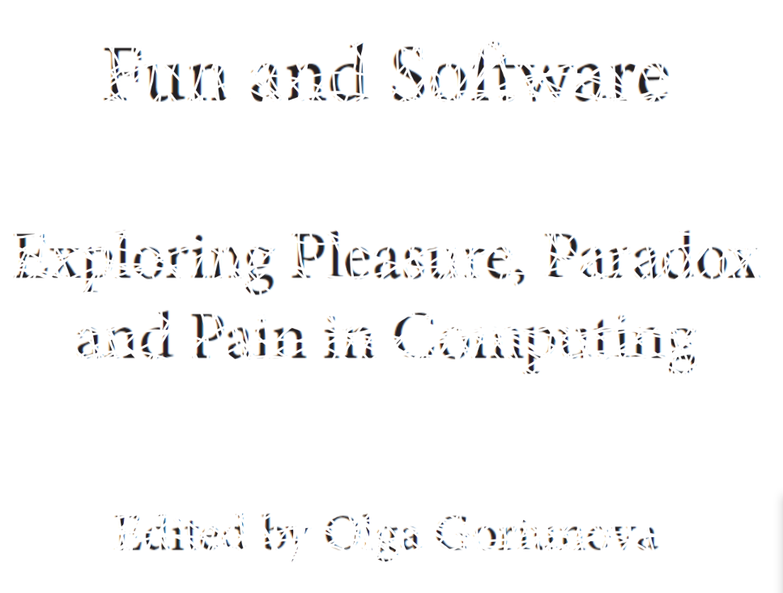

# mini_ex2
*Mark Staun Poulsen*

And so mini_ex2 has been completed. Well, not really. I must admit that I have ideas on how to expand on this (which is great), and especially also on how to make it just feel a bit more polished. Away with an odd arrow for instance, bring in the scrolling function perhaps, and also include the entire text and not just five pictures.

Oh, and [click here to initiate your request](https://rawgit.com/Mmarksp/Aesthetic_Programming_2018/master/mini_exercises/mini_ex2/indexex2.html).  
Note that you can also use the *mouseIsPressed()* conditional statement to interact with the canvas. Your choice.
 
 
 
While it may not be obvious, my program is using a simple shape that is vital for everything that is happening on the screen: The ellipse. I have also used a series of images, drawing from and litterally on Olga Goriunova's notion of fun. I suppose that is also, where the element of fun is included, but I will come back to that.  

Within my code, you will first notice a lot of variables. They are all essential to my program. The first one, *sho*, is also the most recent variable I implemented. I discovered that I was not able to use the function *mousePressed()* to switch between all of the pictures. The program would only be able to switch between "true" and "false", which led to a cycle of only two loaded pictures, as I had fixed two pictures to those two states, giving no room for the other pictures. To solve this I asked for help, received help, and now I share my insights. Drawing upon the logic of boolean variables, instead of distancing myself from the two fixed states, I was able to construct a variable that would be able to determine my position within the series of images, instead of simply creating a first state (which was my original thinking). Thus, I refer to the code up above.
For every click *sho* changes its value (img, img2, img3) and therefore opens up a "passage" to another conditional statement for every click (while shutting off passage to the previous ones). Logic explained with metaphors. How quaint.  

I have used conditional statements quite often throughout this code. Through such statements I have been able to set up boundaries for the chaotic ellipse that is moving around the canvas. I did not want it to reach beyond both *windowWidth* and *windowHeight*, so I set up conditional statements in order to control its random trajectory.  

There are other elements to my project. I will mention two. Firstly, I made an arrow shape, but as you can see in the code, I could have used the exclamation point as an abbreviation in order to tighten up my code and make it look a bit better. I tried it, could not get it to work. Any advice? Secondly, I think the *cursor(WAIT)*-symbol is essential in getting my idea accross. The throbber icon is imbedded with previous experiences and expectations towards it for every user, and as such I am using that cultural capital to complement my work. It is generally feedback, but in this case it is obviously an illusion.  

### The notion of Fun
As I read the initial objective for this week's exercise, "To understand the notion of fun in both practice and theory by drawing upon Goriunova's text.", I immediately knew that I had to literally draw upon the text. Thus, for my creative process I implemented a constraint, which in my opinion has worked really well for idea generation and assessing my work. This is also an element of fun. This one aspect being the center of what I worked with, inspired and motivated me to explore and expand. Although, the heavy use of conditional statements, variables etc. are coming from the amusing The Coding Train-videos, I still used the ideas in conjunction with my constraint. Initially, I just explored with "bouncing balls" and such, but then I increased the speed, made it switch to new starting y- and x-values, added a background image, changed the colour to white, and *voila*. It looks like the text is vanishing. Add a waiting-cursor and you get a sense of who is committing this "vanishing".  

Fun in this work is both found in my process of work, but it is also part of the end result. The work demands that you play along in a sense - even if just to barely reach a point, where you say "what if". Obviously, it is first surprising to see the text disappearing, and perhaps fun because of how it uses a known text for this weekly assignment, but I think the most important "fun" is in interpreting an idea with the work because it demands that you do not think about what is rationally possible with such short coding coming from an inexperienced student during second week of coding. Now, perhaps this idea is obscured, hidden in a way that is inaccessible to anyone but myself, and that is ok - I do not seek to master such matters, and it is safe to say that I have also learned a lot about using p5 for this is exercise, which is also an aspect of fun.
