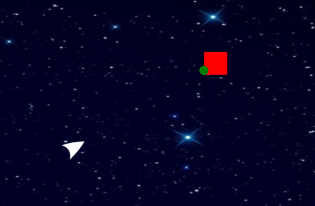

# mini_ex5
*Mark Staun Poulsen*

So this is really not a playable game. Shameful, I know. But not it's 2:23, so this is how it is going to be.

You have a brand new spaceship! Try it out. Oh and also - [you really should have hired a qualified helmsman.](https://cdn.rawgit.com/Mmarksp/Aesthetic_Programming_2018/8e9e773d/mini_exercises/mini_ex5/index_mini_ex5.html) Beware of dangerous space minimalist red squares out to get you.  

## Presentation - skip this
This program, while impressive (irritating) in its complex structure, is actually not completely my doing. I heavily relied on Schiffman's video on coding the game, Asteroids. I have tampered with some of the code, added some more, and ultimately I think, I have made it my own. On one hand, this reliance on Schiffman certaintly does not bode well for the future. A lot of this code would never have come to me on my own, and as such this augmentation of my capability for programming, is really not very reflecting of my actual skills. On the other hand, this has also been a perfect way of familiarizing myself with the syntax of class based and object oriented programming. OOP is very difficult to grasp, but using this template from Schiffman and then expanding upon it, I have been able to become well acquainted with the idea, and also with some of the potentials. I will make a clear distinction between my own work and Schiffman's work, as I move along. For now, let us talk about frustration. Move on to Technical terms for a description of the idea and the program.

## Frustration - skip this
The best moment with coding must be, when everything aligns and you see the realization of an idea brought to life in a program. The worst moment must be seeing "a.push is not defined in p5.min.js". In the beginning stages of my process, when I was just trying to bring a red square to life in my space world, I had a lot of frustration with the use of array.push(). I had set up my class, I had the proper syntax and my idea was even very simple: I just wanted to add new objects to my array and have them rendered on the screen. As I tried everything, even turned off my anti-virus (mcafee would call this a sign of insanity), I felt as if my mind was crumbling. I had no hope of even grasping what was going wrong, as the only information given to me was... "a.push is not defined in p5.min.js".

The solution? In pure desperation I stumbled upon a recommendation online: "Try to stay away from words that are too generic such as just "id" or "name" as they will likely be keywords in JavaScript.". And of course this was the problem. I had defined the squares within an array called sq. This was not sound with JavaScript, but without any reasonable feedback for a person with a limited understanding of programming, I was just grasping in the air hoping to achieve something. Oh and there was also a deadline.

## Technical terms
Finally, I achieved success with the addend() and new variables, and then I could move on to properly realise my game. The idea was to create an asteroid-inspired clone with some slight differences. The controls and the look of the spaceship is very similar to the one from asteroid, and it was especially in coding this that I relied on Schiffman almost completely. In this "clone" the player would navigate the level, avoiding the shooting coming from an endless stream of angry red minimalist squares. To fight back the player could use the mouse to shoot down the individual squares by clicking on them.  
The idea then was to realize both familiarity with the controls, but adding a feeling of clunkiness in the controls, as they player would have a hard time navigating, while shooting (hence the name of the game: "You really should have hired a qualified helmsman").  
Unfortunately, not everything works. I still do not know, how to have the "bullets" actually come towards the player.

In the program I have made three main classes.
_Square_: The core functionality for this class was for it to be initialised in a new location upon the death of a previous instantation. This I sought to achieve with the use of an array and the ability to append / push new objects to the array and splice / remove a previous object upon death. This idea, and the setup of my class, could easily have been expanded upon. I could have initialised more than one square at the same time, I could have added a counter for each destroyed square, and I could have implemented more enemies in the same or in different categories. The death of a square can only be realised if the player actually clicks within the object.  
I also wanted to have the squares shoot at the player. Hence the shoot()-function. However, it becomes more difficult to navigate with classes underneath other classes. In the end, while I achieved some compatibility, I did not realize my actual want.  
_Bullet_: The bullet was intended to be initialised from the square-class with a slight delay in time so as to achieve this constant, automated firing upon the player. Having to avoid shooting, aiming and also just steering the spaceship in a somewhat sound direction is very difficult (especially if friction is set to 1). Interestingly for this object, while its movement was defined in a similar way to my avatar, I still had the trouble of specifying that the bullet was supposed to move towards the avatars changing locality. Thus, I used trigonometry and atan2()-function in order to achieve this. It makes sense to locate the ratio-value between the x- and y-values of two different locations (location of bullet and of avatar), and then use the information to calculate the angle in degrees. You can see the effect, but the bullet is otherwise static in its spot. I think its static state stems from me having written the code in a way so that its location is repeatedly brought back to the starting point of the red squares. Furthermore, if it did move, it would still follow the player around the canvas, instead of merely shooting in an initial direction.  
_Avatar_: Lastly, the avatar is the most complex construction in this code. And it is also almsot all based on Schiffman. My own contribution lies mostly in the added backwards functionality, and the set up of constructor arguments. However, following Schiffman, delving into the logic, has brought insight and familiarity, both of which I appreciate a lot. I see this week as a success.  

## Characteristics of Object-Oriented programming
Overall, the character of OOP is that of constructed abstraction. More specifically, this abstraction is only real because a programmer has defined it as such. Thus, the use of classes and objects is first of all a human approach for ease of control and manipulation of the code. There are several characteristics. A first one is that of the object. Constructing an object means collecting the constructed arguments, parameters and functions within one object. Thus, this object can be regarded as such, and describing the object then means describing its imbedded attributes and components. Objects can be very different from one another, and this adds a layer of individuality on every object. However, comparing to objects together is mostly appropriate if the objects stem from the same class. In this regard it becomes harder to distinguish one another, because they are essentially one and the same on some levels (like my red squares in their form), but still very different in other aspects (my red squares in their spawning location). Ultimtely, with a system of such abstractions it also becomes easier to apply a conceptual model of which objects, classes and other abstractions easily apply. It is a way of organising, and while indeed very reasonable for large scale software development, they are also imbedded with political and ethical issues to take into account.  

## The wider digital culture
It is these issues that I wish to mention in this last paragraph. Object Oriented programming is inherently problematic because it is a simplification of code through abstraction, and while this is good for development, it makes the translation of real life processes into code even more problematic than they already are. Fundamentally, some people (including me) argue that this translation cannot fully incorporate real life. Nevertheless, we increasingly see how digital software attempts this anyway. One very problematic aspect is found with gender. In real life the obvious dilemma lies in the bathroom culture, where on a societal and social level we have seemingly abstracted ourselves to limit the number of genders to two. This then becomes very problematic, when the complexity of real life gender identification applies itself. This system can easily translate to software development, where gender options have to be defined by the developers prior to user interaction. It is a fundamental aspect of OOP that the programmer becomes responsible in defining real world processes. In video games this can become especially apparent, as video games seemingly attempt to model real worlds within a playful system. Of course, video games are often very aware of this, and good game design is often to embrace the references towards the medium itself. Nevertheless, in many, many (perhaps even every) games there are still very subtle, often obscured elements of programming that finally communicates something about the real world - but as seen from a playful system that is not at all a direct translation of real life. This is especially obvious in military shooters, where both the ridiculously unrealistic gameplay components and the narrative structure end up communicating things, which we should be very critical towards. While it is "still just a game", this story of war that the game wishes for us to immerse ourselves in and participate in, is leaving out so much of what war is that it becomes a completely fantasized world not at all resembling real war. It is both in lack of criticism in its narrative structure, inclusion of bad things happening to the player and acting in war translated to simple, playful mechanics, that are Object-Oriented Programming shows its potential hurt in modelling real life.  
In the end, video games are entertainment, and noone really wants to be in war. So is it ok to model the world like this? Should video games live up to a standard, or rather seek to inform the player of their fallacy in depiction of realism? In the center of all these questions lies the possibilities and limitations of Object-Oriented Programming.
