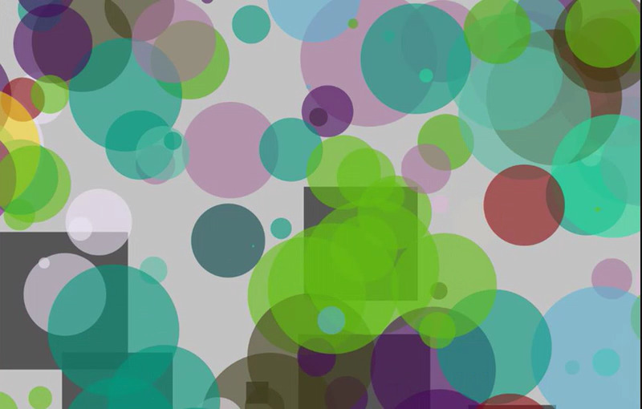

# mini_ex6
*Mark Staun Poulsen*

   

I introduce you to my generative program. I call it [changing fixations](https://cdn.rawgit.com/Mmarksp/Aesthetic_Programming_2018/cc554425/mini_exercises/mini_ex6/index_mini_ex6.html), so named after the two objects in my program.   
WARNING: lots of bright and very quickly changing colours in my program.

This piece is generative both while running, but also every time you reload the page. Besides reloading the page, you can toggle between the defined shapes for the objects using X and Z.

## An introduction - what am I looking at?
Good question. I had to spend some time figuring out what it was as well, as it ultimately came to be while trying to achieve something differently. My program consists of two classes, fixations and changers. Fixations are the moving shapes on the screen that are coloured using the gray scale. Changers are the fixed (ironic I know) shapes, whose colours are very changeable. It is through the setup of speed and direction for the fixations that they start moving once they are drawn, and it is when they interact with changers that the colours of the changers... change.  

I think my code has a few things worthy of mention. In the initial setup direction for the fixations, the direction is chosen randomly based on an angle between 0 and 360. If I was to expand on this project I would probably experiment with differently chosen directions through the sketch running. This could for instance be achieved every time the fixations touch one another, or when they get too close to one another they could move away so as to avoid touching in the first place. The speed of the fixations is also interesting as I have mapped() the size of the shapes to the speed of the objects. Thus, the bigger they get, the slower they become.  

Every time a fixation touches a changer, the colour ascribed to the fixations (not their actual colours, but values contained within the class) is painted onto the changer. Not only that, all other changers are affected too with the same colour. This was actually an accident. Originally, I just wanted a local interaction, where the fixation would just paint a colour on the individual object. I am still not sure how to achieve that, but I also really like this different result. It is worthy of note that more than one fixations can impact multiple changers at the same time. Thus, a fixation with green colour and a fixation with blue colour touching two individual changers at the same time, will actually result in both blue and green changers at the same time. I think this result stems from the fact that a fixation interacts with an object that is actually contained within an array of objects. Therefore, it is my guess that if the same scenario (green/blue) happened, and the changers were defined as changers[1] and changers[200], then the changers would be painted green from changers[1] through changers[199] and blue from changers[200] through the remaining changers.  
*Later note added here: a little more technically, every changer is actually checking for every draw whether or not it is impacted by one of the x-amount of fixations. Also credit to Schiffman for the setup of such a "tracking" system. *

Lastly, I have also set up the program so as to randomly choose between a variety of parameters to choose from in every reload of the program. I like this, because it still gives me enough control to specify a setup choosing between more than one outcome for the program (I like them all, and I also get to define the parameters!), but at the same time I am left to be surprised by my own program in the variety of outcomes avaliabe from my setup. The final results of my program is a very dynamic generative piece that, through my specified rules and parameters, is able to be generative only to a certain extent, but still enough to keep it interesting and surprise me every time I run it.

## Generativity
Generativity is very central in the relationship between programmer and computer. In conventional art forms we are used to the fact that an art work is a direct connection to the artist him/herself, and that the question of authorship, while still able to be debated using notions such as "death of the author", is still fixed to the person, who has made the work in the first place. However, in programming - even if the program is very limited in its ability to generate emergence - the computer becomes a vital actor within this metaphorical connection between author, art work and eventual receiver experiencing the work. The computer cannot simply be brushed away and explained as to just be a tool in this matter. Generativity in programming heavily involves the computer crafting something the programmer is not deciding and has not fully anticipated.

Now of course, it is most certainly obvious that the program does not come out of nowhere. The programmer has written the code, written the rules and logics of the system, but upon a press of the button, the programmer releases control and hands over the course of action and development to the computer. Given this concession of control (as Phillip Galanter puts it) the spectrum, which the author is conceding control within, must be analyzed and grasped in order to further acquire a developed understanding of what "authorship" actually means when art becomes generative.

Before I venture forth into analyzing my own work, I would like to mention how the validity of authorship is already problematic in conventional art forms if viewed from the very strict sense I described in the beginning. Generativity is not unique to programming. Mozart used dices in composing music at times. John Cage delved into (pseudo)randomness too. Thus, generativity only really depends on rules that forces the author to concede a control in terms of directing the work. Math, dices, chance etc. - all of these concepts are often found in generative art, because their nature defies the detailed direction of an artist. In a similar sense, the question of authorship is also put into question if the art work is more an idea than a technical work, such as through performance art, plagiation, or in sending in a urinal for display at a gallery. In video games much of the experience is also determined by player agency, which is also an element that distances the actual authorship.  
Nevertheless, we do not dismiss the author in both Marina Abramovics peformance art, nor in the social experiences from video games such as World of Warcraft.  
I realize that I am treading in very wide spectrums of understanding art and experience, and in this sense my conlusions can seem too broad. Nevertheless, I will conclude that we do not generally dismiss the author in any art/product of entertainment, whether the art is a product of technical skill, or dependent on the unique situation and the person experiencing the work. In this sense, I do not believe that we should dismiss the author in programming. The product is inherently made through the decisions of the author. This is also the reason, why Mozarts random compositions are still *his* random compositions. It is true that the machine is running the program, but for a machine to do this, a programmer must have set initial conditions.  

I think we should go with an understanding that we cannot cut off the author in this sense. However, I also think there is a spectrum of authorship that can determine to which degrees the author is involved. Whether a too limited inclusion of author determines that authorship can be reloacted completely, is still something to ponder. So far, have we actually seen anything approaching this sense of complete autonomy and fully putting the matter of authorship into question? 
What I want any reader to take away with all this, is that the authorship in generative is worth digging into; not in that the author is actually left out in generative sketches, but in that programming is a very unique medium, which both puts into question our assumptions about art, but also adds a spin towards what art can be and become.

I wonder: Can the works from abstract expressionist, Pollock for instance, then also be deemed generative art? Is that "subconciouss force" also an aspect within generative art? There is an imbedded layer of subjectivity that distances it from rules and math and science, but at the same time, is the author conceding control, when the process of producing becomes so fast and so lacking in fine detailed control. Mozarts use of any dice must also be an approach partly implicated by the person throwing the dice in the first place. Dices aren't completely random. Is anything actually random (pseudorandomness)?

Last but not least, I will comment on my work in relation to this tension. I feel I have assumed a certain dominance of authorship within this work, because I have added these fixed parameters from which the machine must choose from. At the same time, I have also explicitly referenced and visually highlighted the autonomy of machine. The pseudorandomly chosen direction of the movement of fixations is at some point going to interact with the pseudorandomly chosen locations of the changers. A cause-and-effect causal relationship between the two objects, which is put into action by the machinery and the code. Thus, the generative process is determined by the machine, which is a delight to me, the author, but the conditions are also defined by me, and therefore not prone to any change I have not accepted in the first place.
You can also take my code and do stuff to it. You would insert your own authorship.
