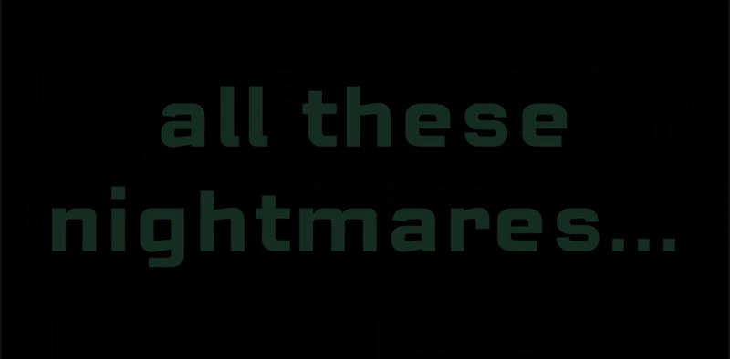

# mini_ex7
*Mark Staun Poulsen and Frederik la Cour*  
Written by Mark.

Frederik la Cour and I have created a text-focused program. It is an homage to the excellent movie [Enter the Void](https://www.youtube.com/watch?v=wNtxgxYY7sI&t=12s), of which you can watch the intro sequence here.

Warning: lots of very fast changes in brightness and colours.

Our program comes in different variations, though the one you should concern yourself with is [this one](https://cdn.rawgit.com/Mmarksp/Aesthetic_Programming_2018/6cc44ed0/mini_exercises/mini_ex7/index_mini_ex7.html). I have taken the liberty to add the others in the repository, because I love variations, and because I think they also show some of our progress building the program. However, currently the program does not work with RawGit. You can view it in video format right [here]().

There is no interaction with the program other than reloading the page.

## Technical description
You are looking at a text-focused program. What does that even mean? It means that we have taken upon ourselves to include text as a major component of the program, and that we became inspired by the intro sequence of the movie, Enter the Void, of which we have tried to replicate in a sense.

The program itself consists first of all of a .txt file. Within this file the entire script for the movie, Enter the Void, is located. There are some alterations on our part. Firstly, we have written essential information in the beginning in order to understand the content of the file. Secondly, we have made multiple line breaks within the file, which is necessary once the file is converted within the main .js file. The rest however, is simply taken from a website and put into the .txt file.

Initially we had a very different idea of what our program was going to be. It was only until later that we scrapped our initial ideas in order to develop this "homage". However, in the initial idea we tried to use .JSON in order to incorporate data for our program. La Cour tried extensively to make it work, but ultimately we had to give up and instead use a .txt file with data. We read up on how .txt was used with functions such as loadStrings, and thus we were successful in implementing such a file. We then used this knowledge for the new idea, which you are currently reading about.
Once the function loadStrings is used, all the strings (characters and spaces) are ordered into a single array, differentiated by every line break within the .txt file. This is why we have divided the script this way. It took some time, but the website, from where we literally snatched the script from, had already done a large part of it.

With the script divided into an array, we then used objects in order to implement every line from the script with certain attributes defined through the object. Attributes include colour, font, size and location on canvas. We then gave the object two methods. First method is the display-function, which has essential text-based functions using the font-, colour-, size- and so forth attributes. It also has two interesting if-conditional statements, though I will ignore the sound-related one for now. Originally (as can be seen in the alpha-version), the text was set up so as to stay on the screen for a longer time, and the text was also going to flicker. This is directly taken from the intro sequence of the movie. In this final version, the text is instead passing by much faster. This changes the effect of using the flicker-option, but I do not believe that its value has therefore also decreased. The flicker is still a part of the program, and you can easily see the difference if you remove it from the program. The second method of the object is called FixTimeLoop. This is essentially the function determining, when the display function will change to a new iteration of the object. This is done so through the incrementation of the J-value, which determines the object to show. This incrementation is controlled with modulo ( % ), which takes the constantly increasing value from frameCount and uses it to activate the incrementation of J every time the counter reaches any multiple of 8.
Thus, with the different attributes given to every object instantiation through the object definition, a constant cycle of changing text-sections are displayed on the screen until the movie-script is done, and the final word void is all there is left. We have also chosen *a lot* of fonts for this program. They are preloaded, but the setup is not exactly optimal. It was probably necessary to some extent to set it up such as it is, but we originally tried also using .JSON and .txt in order to reference the right strings that would further reference the proper font-file to be used.

We have also implemented music, which actually has a functional working on the program other than being played. The track used in the final version is "Freak" by the band, LFO. It is also the same track, although modified, which is used in the alterated version of the program, which is further also used in the movie itself. The frequency span of the track is then analyzed by the program using p5.fft, and with the added peakDetect, the program will have determined specific peaks of the devleoping frequency, from which functionality in the beforehand mentioned display-function is initiated. Every time a peak is detected, the background will for one frame display a completely white background, and then change to a black background afterwards, when the peak is no longer detected.

I think this description covers the essential knowledge in order to understand the functionality of the program. But what is the relation to the literary qualities of code?

## Language + code
It is an inherent condition of code that the content, which is essentially written by the programmer, has to have operational value. Code must work, and writing in programming languages means that the structure and layout of source code has to conform to the conditions for achieving operational working within the computer. Operational semantics of code, the direct value of source code in the workings of the computer, must be written correctly in the source code in order to communicate and initiate any operations deeper within the computer. Essentially, code must be grammatically correct in order to work.
However, this also means that source code is able to implement those conditions as part of its expressive property. As Cox and Mclean write in the text *Vocable Code*: "programs can be called into action as utterances" (p. 19). Programs are expressive in other ways than the usual instantiations represented as the output of the program, and this aspect is directly tied to the expressive property of code itself. Code can for instance been seen as poesy, a purely literary distinction, and its poetic aesthetics use the operational semantics of code as an expressive quality in its own right.
I think it is too short sighted to see the boundaries of code and grammar as then expressive limitations: that code cannot bend the grammar and still work, and that this is bad. Instead, those boundaries actually help define the medium of code as a unique and distinct variation on conventional poesy, or as something else entirely. It expands our expectation of what poesy is and can be. Grammar becomes a challenge for the poet - both in getting the program to work, but also in adding an inherent double meaning to it. This second understand of the grammar of the source code is purely directed at the reader of the code and not the computer itself. It has no effect on the operational semantics. The double meaning highlights the programmer's achievement, a subversion of operational boundaries of code, in order to achieve expression.
A good comparison to use in order to highlight the use of boundaries within the arts, is how paining on a canvas is limited to the edges of the canvas. This does not diminish the value of painting as a medium of expression. Rather it gives it character. It makes it so that quality within the boundaries becomes easier to locate, experience and understand, and it also makes the quality unique and different from other variations of aesthetic expression.

Before I continue, I would like to just add that I am not sure if my understanding of poesy + code is as is intended after having attended the lecture concerning the subject. Nevertheless, I will continue. If it does not make sense, or if it does not include vital points in order to understand language + code, do let me know!
I also remark on this, as I suspect that my specific analysis of the poetic capabilities of our work, will be lacking somewhat.

## Analysis
In our program we have used an entire script as our body of text expressed through the program. The text itself has literary qualities in its own right, but it is not of our making, and thus I will leave it out of my analysis. Instead, we have added expression, not visible in the source code itself, but in the output of the program. This may or may not be wrong in terms of the requirements of literary expression from the code (as understood from reading and attending the lecture), as it may be a condition that the source code itself must be expressive. Our code is actually just a display of the functionality. It is not imbedded with any double meaning, and it only serves the purpose of working within the computer and aiding any reader seeking to understand the functionality of the code.
The output of the program however is where our contribution is added, and where any expression must be located.

It was essential to our program that we try to replicate the intense and shaking experience of viewing the intro to the movie, Enter the Void. We deemed that it required a rendering of text in a way not accessible for any human reader. Thus, alienation is actually a big element of the expressive output of the program. The text is discernible, it is easily read and understood in its own right, although the understanding is cut off from the movie itself. However, the reader is still able to read the text in the text file. Contrastingly, there is no hope of actually understanding anything through running the program. The words go by too fast, the sentences are sometimes cut off by the technical limitations, and the different fonts are difficult to read. Collectively, it is hard to understand anything beyond a very sensual experience. This sensual experience is best described as intense. The use of flickering in the text- and background colour add to this intensity. We think it plays along nicely with the music, and that the program is sufficiently related to the movie itself, which is also best described as very visually intense.
