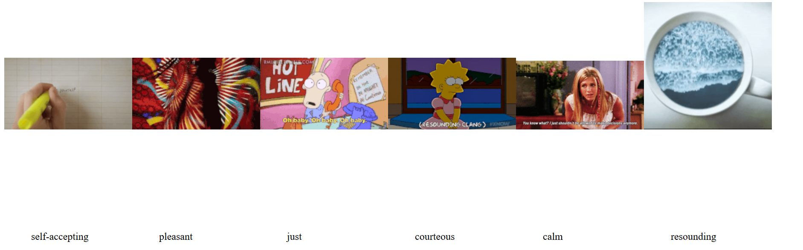

# mini_ex8
*Mark Staun Poulsen, Frederik la Cour and Martin Hansen*  
Written by Mark.

Martin, Frederik an I have created a program that actively and continuously uses an API. The API in question is Giphy's API: a large online service for distribution of gif-files.
You can experience it [here](https://cdn.rawgit.com/Mmarksp/Aesthetic_Programming_2018/fc238976/mini_exercises/mini_ex8/index_mini_ex8.html).

## description
What is our program exactly? A simple query instigator using an API? Data visualisation? A translation of words into gifs? A funny gag to lighten your day or critical inquiry into the semantics of gifs as a cultural phenomenon, artefact and language?

At a technical level our program utilizes Giphy's own API in order to load designated JSON-files filled to the brink (Giphy's limit for files per query is 25, unfortunately) with gif-URL's.
The program is set up so that it initially loads one set (6 gifs) upon running the program, and then through the setInterval() it iteratively runs the functions every 15 seconds. As you can then see, the program produces 6 new gifs every 15 seconds with the related words displayed underneath. Sometimes the words match directly with the image above, sometimes they do not. I am not sure why this is - perhaps files finishing loading first are also displayed first, which can easily lead to a mismatch in the order of gifs?
However, before any of that happens the program first loads a local JSON-file consisting of a multitude of "positive and encouraging_words" namely adjectives. This list is built using a template of encouraging words, from which we severely expanded upon and made modifications to. Therefore, this list of words is of our own making, and it is important to recognize this personal involvement in the creation of the list, as these words ultimately become of our making. We have chosen what is and what is not encouraging and positive.

The getRandom() is the easiest function to understand. It really just chooses a random word based on the loaded "encouraging_words".JSON. This JSON file is loaded as an array, and from that array we can choose 6 random words for every iteration. In the beginning, the function removeElements() is used so that the previous iteration of gifs and text is deleted just before the others are loaded and displayed. The loaded words are then also displayed in this function. This makes it so that the words are visible to be seen in relation to the gifs, of which the words are directly involved in retrieving from Giphy's database.

The next function, askGiphy(), is a little more complicated. Instead of just one JSON, the program actually loads six JSON-files in total based on the six random words from the previous function. This makes it so every gif is not coming from the same JSON file. We quickly experienced that a 25-limit for every query oftentimes resulted in the same gif being displayed repeatedly during the iterations. Ultimately then, the former variable, data, is an array, where every parameter, a JSON-file, is also an array (because the JSON is loaded as an array). There has been assigned a callback function, gotData, which results in the function being called directly after the loadJSON-function. Therefore, the gotData is actually called upon in every iteration of the loop in the askGiphy-function.

In this function, a random number between 0 and 25 is chosen. This number has to be a whole number (which is why we have used the floor-function), because it is directly used afterwards to choose a random gif from the a loaded JSON-file of 25 gifs. This chosen gif is then displayed.

## Personal Reflection
Ultimately, our program then becomes a lot about this querying process. It displays a visible starting point, which is also in itself wrapped around a theme of encouragement and positivity (though we have defined what is positive and what is not), and then it displays a visible end product - a gif directly coming from querying using the predesignated word. This end result, the gif, is in itself a system of meaning very different from the original words. What our program then highlights is the existence of  processes and components involved in using a word imbedded with its own connotations in order to choose a gif. It points out that there is a system of logic going on within the databases underneath the APIs. This system is ultimately responsible in transforming the word into "tags" and whatnot, which then results in something that is oftentimes not exactly encouraging nor positive. Something is lost in translation.

The encouraging words have meaning. Even if you separate them from the list, the words can still be imbedded with many connotations related to encouragement and so forth. However, within a system of computational logic, these connotations are completely disregarded. Instead, it is the structure of the database, the API, which is a product of other programmers, that then decides what each and every word can correspond to, when they are used in a query.
Furthermore, our program also highlights interesting distinctions between words and gifs as they are displayed next to one another in our program. Gif is ultimately a language with its own unique semantics. Often these semantics are very different from words themselves, not just in the manner of how they are conveyed (different medium), but also in the actual meaning of the content that is conveyed. Not only is something lost in translation in the databases, but the actual meaning coming from the gifs themselves become even more absurd, once you see them in relation to the former encouraging word.

Finally, what our program also speaks of is how Giphy itself, a service for providing content shown as gifs, is also a major player in determining what is allowed within their databases. The service, and also a larger culture outside of the service platform, also encourage certain norms for content production of gifs. These norms can often be something like: "has to be funny" or "must reference Western pop-culture". This makes it so that all of these components and processes (both cultural and computational) taken together necessitate that a single word (itself also imbedded with connotations) has to go through multiple and enormous transformation of semantics and meaning in order to finally produce a gif. Much is lost in this translation, but a lot is also added during these processes.

## Future research
I would want to investigate this very precarious field between cultural and computational components in the creation and workings of database systems. It is inherently important to understand that databases are data management systems. Data is itself a material representation and transformation of real life processes and workings into a computable format. These databases, themselves programmed and imbedded with many processes for management, become part of this representation through their structure and workings with data management. This is the conclusions coming from Paul Dourish: NoSQL: The Shifting Materialities of Database Technology. He also concludes that data bases have an effective form: They work as an engineering artefact directing and structuring the operation of computer systems.
Therefore many computational processes are part of any database system, which removes the notion of neutral or objective representation completely. There is indeed a translation, transformation and mediation of real life. But databases are also not neutral. They are made by programmers, they are updated by programmers, and the context, which they used within, spans much farther out than one programmer is able to see during his/her programming. This then also taps in to the larger political spectacles concerning APIs and third-party users. This then also becomes a perfect example of why we concern ourselves with Software Studies. There are indeed computational processes, but as is shown with our program here, those processes tap into many cultural, personal, social, political, ethical aspects of lives. I would want to understand this more as seen from this database system.
Of course querying then also taps into this, and understanding a database also means understanding the processes from which another device taps into the database in the first place. I think it becomes especially interesting, when we are here on this threshold between the computational processes and the happenings of using these processes as representation of life. It's useful of course, as seen from business and engineering perspectives, but it is also problematic. How can we for instance begin to understand the transformations of semantics, language and content of meaning, when we tap into a database using just a word and the click on the search button?
