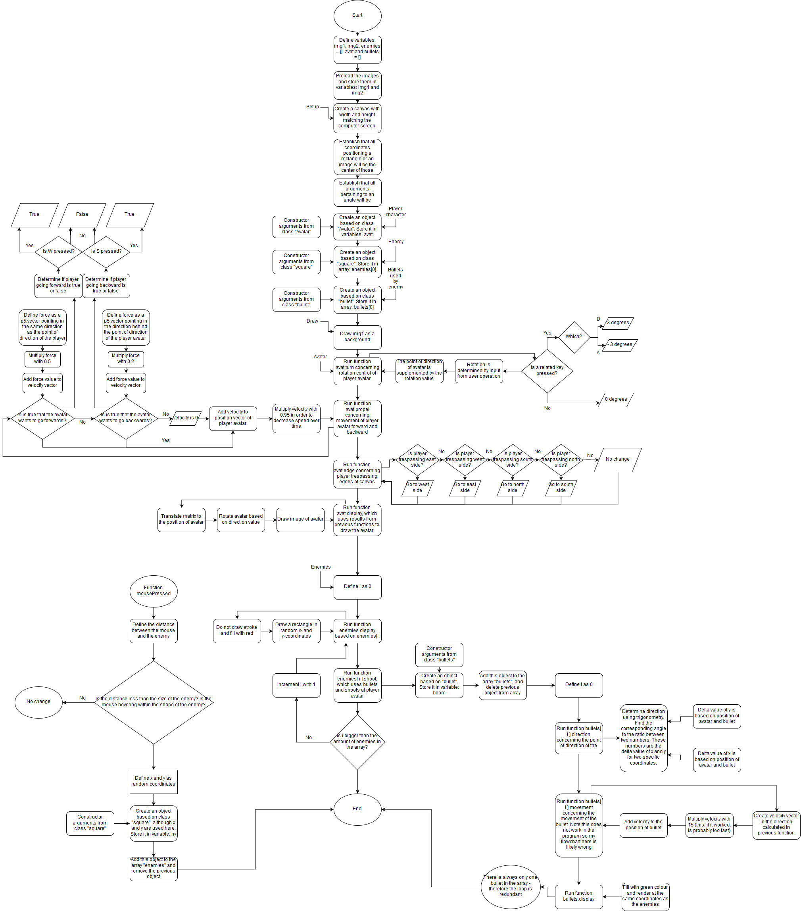

# mini_ex9
*Mark Staun Poulsen*

For the individual work with one of my own previous mini_ex assignments, I have chosen the most technically complex one: [mini_ex5](https://github.com/Mmarksp/Aesthetic_Programming_2018/tree/master/mini_exercises/mini_ex5) (the one that never worked properly). Do open the picture in another tab to be able to zoom in.

I have not drawn this flowchart so as to be conceptually easy to grasp. Rather I have attempted to recreate a flowchart showing an in-depth representation of the workings of the algorithms within my program. Of course, this representation is not actually related to the mini_ex. Rather, it is a representation of my own conceptual understanding of my program. This means that I, for instance, do not write more to a function such as createCanvas, because I simply do not know how that function works besides resulting in creating a canvas. My understanding is quite limited, especially when it comes to the actual workings of a computer, but there is still a logic at play in the transitions between functions and dependencies of other function, which I think I have attempted to capture rather extensively.

I suppose this also speaks to the difficulties of drawing flowcharts. In the end, they are not actually representative of the workings of a program - not fully. Instead, the author must assess the function of the flowchart, whom it is intended for, and therefore decide how conceptually abstract the drawing must be. I think it is safe to say that many of these functions could be abstracted further into much simpler explanation. The avat.turn function could be written as something simpler: run function, check if A or D is currently pressed, return either -3, 0 or 3 depending on key pressed or key released. However, there is a danger in abstraction. While it can be great for communication, abstraction can eventually go so far out as to lose the important key elements that constitute understanding the algorithms of a program. Where this is, how far it is out and how it varies depending on the persons seeing it, are very good questions to ponder.
